<h1 align="center">Hello there 🤙</h1>

    

 

<!-- I'm Erwan, I'm currently studying computer science at [EPITA](https://www.epita.fr/), in Paris. -->

- 🔭 I’m working on a [QRCode generator](https://github.com/erwanvivien/QR-Gen). I'm also working on a PWA using Spotify API, project is name [Qify](https://github.com/erwanvivien/qify).
- 🌱 I’m currently learning rust / react-native.
- 📫 You can reach me via discord `Xiaojiba#1407` or Twitter `@VivienErwan`. I answer everyone fairly quickly, just tell me you come from Github :)
- ⚡ I love sorting algorithms.
<!-- - 🌐 You can find more information on me here: [erwanvivien.com](https://erwanvivien.com) -->

Find more information about what I do bellow ! :eyes:
- [JPEG algorithm from scratch](https://github.com/erwanvivien/JPEG_compression)
- [Discord bot for EPITA](https://github.com/erwanvivien/discord_OverCRI)
- [Discord bot to follow $eGLD](https://github.com/erwanvivien/discord_eGLD)
- [QRCode generation](https://github.com/erwanvivien/QR-Gen)
- [Spotify shared webplayer](https://github.com/erwanvivien/qify)

  
  
  

